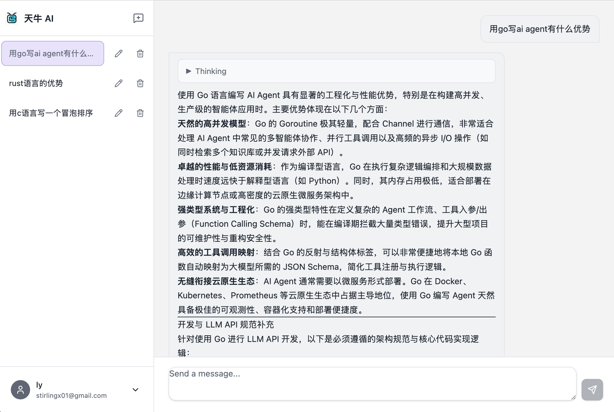

# TianNiu

A lightweight AI chat agent built with React and Go, featuring streaming message processing, tool calls, and multi-threaded conversations.

## Features

- **Smart Conversations**: Fluent AI model interaction with streaming responses
- **Multi-thread Management**: Create, rename, and delete conversation threads
- **Streaming Messages**: Real-time message delivery via Server-Sent Events (SSE)
- **Tool Calls**: AI can invoke external tools to fetch information
- **Reasoning Panel**: Display the AI's thinking process
- **Markdown Rendering**: Full markdown support (GFM) for AI responses and tool results
- **Model Switching**: Configure separate front-end and back-end LLM models
- **JWT Authentication**: User registration, login, and token-based access control

## Tech Stack

### Frontend
- React 19 + TypeScript
- Vite 8
- Tailwind CSS 4.0
- @assistant-ui/react, @radix-ui/react
- react-markdown + remark-gfm
- lucide-react

### Backend
- Go 1.25 + Gin
- OpenAI Go SDK v3
- GORM + SQLite
- JWT authentication (golang-jwt/v5)

## Quick Start

### Local Development

1. **Configure the backend**

```bash
cp config.example.json config.json
```

Edit `config.json` with your LLM provider settings:

```json
{
  "llm_providers": {
    "front_model": {
      "base_url": "https://api.openai.com/v1",
      "model": "gpt-4o",
      "api_key": "your-api-key",
      "context_window": 200000
    }
  }
}
```

2. **Start the backend**

```bash
go run ./tianniu/main.go
```

The server runs on `http://localhost:8080`.

3. **Start the frontend**

```bash
cd frontend
npm install
npm run dev
```

Visit `http://localhost:5173`. API requests to `/api` are proxied to the backend automatically via Vite.

### Docker Deployment

1. **Prepare config**

```bash
cp config.example.json config.json
# Edit config.json with your API keys
```

2. **Build and run**

```bash
docker compose up -d --build
```

3. **Access the app**

- Frontend: http://localhost:80
- Backend API: http://localhost:8080

### Environment Variables

| Variable | Description | Default |
|----------|-------------|---------|
| `DB_PATH` | SQLite database file path | `test.db` |
| `GIN_MODE` | Gin run mode (`debug`/`release`) | `debug` |


## Supported Models

- OpenAI: gpt-4o, gpt-4o-mini, gpt-4-turbo
- Zhipu AI: GLM-5.2, GLM-4
- Any model compatible with the OpenAI API format

## Preview



## License

MIT License